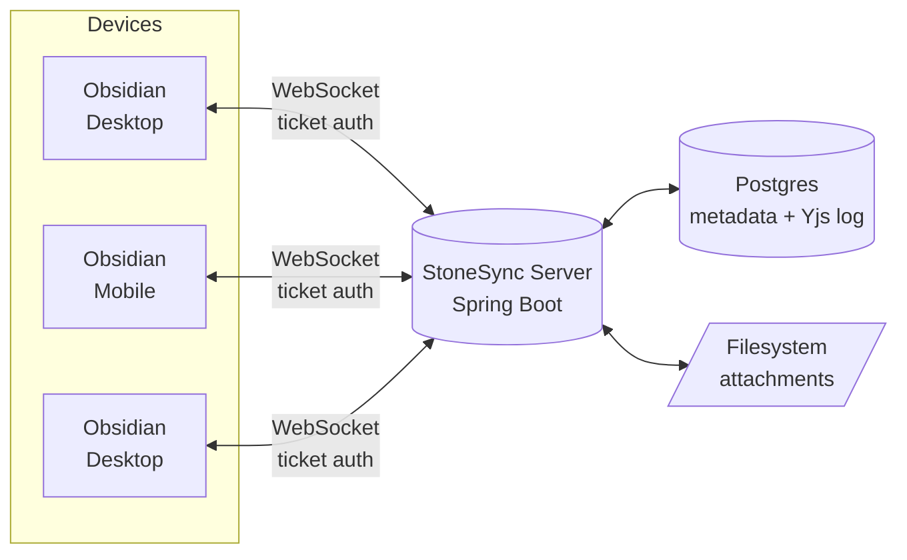

<div align="center">

# StoneSync

**Real-time multi-user collaboration for Obsidian, on your own server.**

Multiple people editing the same vault, at the same time, with live cursors —
no cloud subscription, no vendor lock-in, self-hosted on hardware you control.

[](https://github.com/Raindancer118/stonesync/actions/workflows/ci.yml)
[](LICENSE)
[](server)
[](plugin)

</div>

---

## What is this?

Obsidian is single-player by design. StoneSync makes it multiplayer.

Install the plugin, point it at your own StoneSync server, and every note
becomes a shared, conflict-free document — edited by however many people have
access, with each person's cursor visible to everyone else in real time.
Behind the scenes it's a [Yjs](https://yjs.dev) CRDT, so concurrent edits
never produce merge conflicts or "(Conflicted copy)" files: everyone's
changes just converge.



## How it stays fast *and* honest

The server never tries to understand your notes. It's a deliberately "dumb"
relay: Yjs updates are opaque binary blobs it stores and forwards, never
parses. That keeps the Java side small and lets the actual CRDT logic — the
part that has to be correct — live entirely in the well-tested Yjs library on
the client.

| Concern | How StoneSync handles it |
|---|---|
| **Conflicting edits** | CRDT merge (Yjs) — no conflict files, no lost writes |
| **Live cursors / presence** | Separate ephemeral channel, never persisted |
| **Auth on the sync socket** | Short-lived, single-use tickets (Obsidian's WebSocket client can't send custom headers, so long-lived keys never touch the URL or a proxy log) |
| **Access control** | Every document/attachment/socket operation is checked against real vault membership — no security-through-obscurity on UUIDs |
| **Attachments** | Content-addressed by a *server-verified* SHA-256, uploaded only once per unique file |
| **Renames** | Pure metadata update — the document's identity (and its edit history) never changes, so links don't break |
| **Deletes** | Tombstoned, not dropped — offline devices reconcile safely when they reconnect |

## Project layout

```
StoneSync/
├── plugin/             Obsidian plugin — TypeScript, esbuild, Yjs
├── server/              Sync backend — Java 21, Spring Boot, Postgres
├── docker-compose.yml   Server + Postgres, self-hosted
└── .github/workflows/   CI (build + test) and release automation
```

## Getting started

### Run the server

```bash
cp .env.example .env      # set DB_PASSWORD
docker compose up --build
```

On first boot with `BOOTSTRAP_ADMIN_EMAIL` set, the server prints a one-time
admin API key to its logs — that's your master key for creating additional
users, vaults, and devices via `/api/admin/*`.

### Build the plugin

```bash
cd plugin
npm install --legacy-peer-deps
npm test
npm run build
```

Copy `main.js`, `manifest.json` and `styles.css` into
`<your-vault>/.obsidian/plugins/stonesync/`, then enable the plugin in
Obsidian's settings and point it at your server + API key.

### See it working

```bash
cd plugin
npm test                                    # unit tests (incl. the CM6/editor binding)
STONESYNC_URL=http://localhost:8080 \
STONESYNC_API_KEY=... STONESYNC_VAULT_ID=... npm run test:e2e
```

The end-to-end suite drives two real clients against a running server: edits in both
directions, live cursor presence appearing and disappearing, and a late joiner catching up
on the full history.

## Who may see and change what

Permissions are enforced on every path content can travel, and a note someone may not read is
never handed to them in the first place - it is not listed, not downloaded, no sync socket is
opened for it, and they are not even told when it changes.

| | VIEWER | EDITOR | OWNER | ADMIN |
|---|---|---|---|---|
| Read notes | ✓ | ✓ | ✓ | every vault |
| Edit, create, rename, delete | | ✓ | ✓ | ✓ |
| Manage members, invites, folder rules | | | ✓ | ✓ |
| Vault history and restore | | | ✓ | ✓ |

**Folder rules** scope that further: a rule on a folder (or a single note) overrides the role for
that subtree - `none` hides it completely, or a read-only member can be made an editor in just
one folder. The most specific rule wins; a rule for one person beats the everyone-rule. A blanket
rule never locks the vault owner out of their own vault.

Revoking access takes effect immediately: open editors switch to read-only, and any note that
just became invisible is removed from that person's device (into Obsidian's trash, so an accident
is recoverable).

Everything is auditable - permission changes, content changes and refused attempts - via
`ss-audit`, and per note "who changed this, when, and what exactly" via the note history (backed
by the vault's git history, with the real author on each commit).

Owners manage all of this from inside Obsidian (*Manage collaborators and folder rules*) or from
the server console (`ss-access`, `ss-rule-set`, `ss-audit`, `ss-file-history`).

## What "live" means here

* Every **open** Markdown editor gets its own sync session - not just the focused pane, so a
  note sitting in a background tab (or on the other device's screen) keeps receiving edits.
* Remote cursors and selections are rendered inline, with each collaborator's name and color;
  the status bar shows who else is in the current note.
* Presence is announced to newcomers too, so someone joining a note sees the people already
  in it immediately, instead of only once they move their cursor.
* Notes you do *not* have open are not rewritten under you - they sync the moment you open
  them (creations and deletions still arrive live, vault-wide).

## Status

This is the MVP: the plugin and server deliver real, working multi-user
sync directly inside Obsidian — text sync, live cursors, attachment sync,
vault-scoped access control. A standalone web viewer (for reviewing a vault
without installing Obsidian) is a deliberately separate milestone and not
part of this release yet.

## License

**Source-available, proprietary** — see [LICENSE](LICENSE).

* **Free** for private individuals and for non-profit associations (e.V. /
  gemeinnützige Organisationen) — run the server yourself, use the plugin, modify
  it for your own use.
* **Commercial license required** for any business, freelance, or public-sector
  use, and for offering StoneSync to third parties: stonesync@tstieh.de.
* Redistribution and resale are not permitted under the free license.

Third-party components keep their own licenses, listed in
[THIRD-PARTY-NOTICES.md](THIRD-PARTY-NOTICES.md).

"Obsidian" and the Obsidian logo are trademarks of Dynalist Inc. StoneSync is an
independent third-party project and is not affiliated with, authorised or endorsed
by Dynalist Inc.
